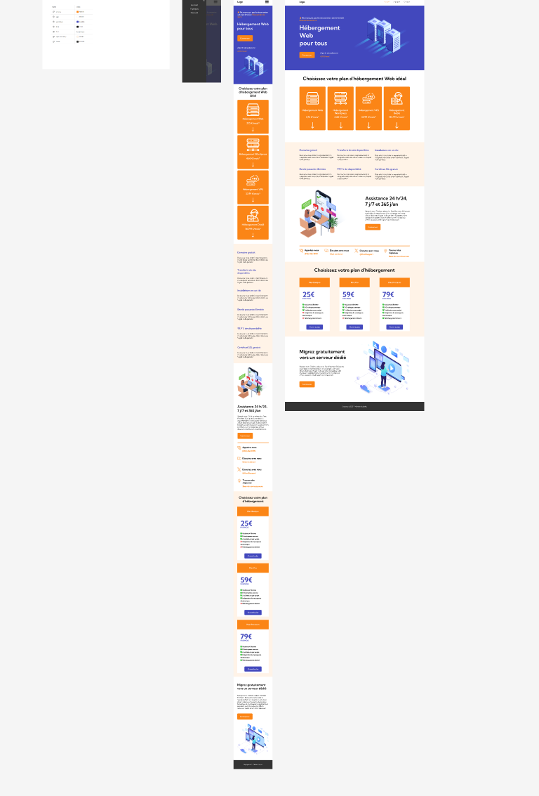

# README - Web Hosting Site

## Description
This project is a promotional webpage for a web hosting service. It provides various hosting plans, service details, and customer support information.

## Technologies Used
- **HTML5**: Structure of the website
- **CSS3**: Layout and styling (Bootstrap and custom CSS files)
- **JavaScript**: Interactivity and navigation handling (`script.js` file)
- **FontAwesome**: Icons for improved aesthetics
- **Google Fonts**: Custom typography
- **Bootstrap 5.3.3**: CSS framework for responsive design

## Content
The website consists of the following sections:
1. **Header**: Navigation menu with a logo and a burger button for mobile versions.
2. **Introduction Section**: Promotional offer with a sign-up button.
3. **Hosting Options**: Various pricing plans with images and descriptions.
4. **Features**: Benefits such as free domain, unlimited bandwidth, and SSL certificate.
5. **Support**: Information about 24/7 customer support with call and chat buttons.
6. **Pricing Plans**: Details on Basic, Pro, and Premium packages.
7. **Free Migration**: Promotion for migration to a dedicated server.
8. **Footer**: Legal notices and copyright information.

## Installation and Usage
1. Clone the project:
   ```sh
   git clone https://github.com/your-repo.git
   ```
2. Open the `index.html` file in a browser.
3. Ensure the CSS and JS files are correctly linked.

## Screenshot


## Possible Improvements
- Adding a payment API for subscriptions.
- Integrating a contact form.
- Enhancing accessibility and mobile compatibility.

## Author
- Name: [Your Name]
- Contact: [Your Email]

## License
This project is licensed under the MIT License.

